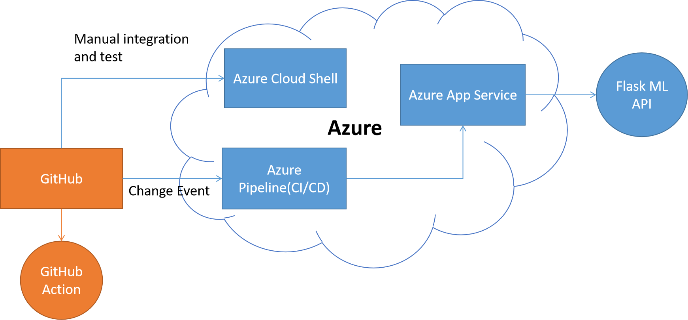
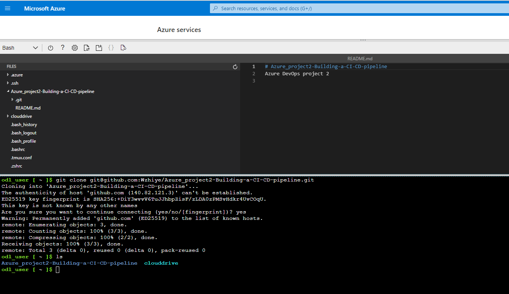
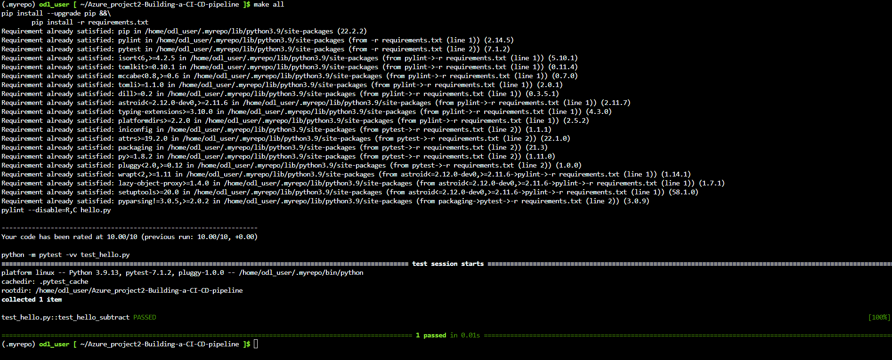
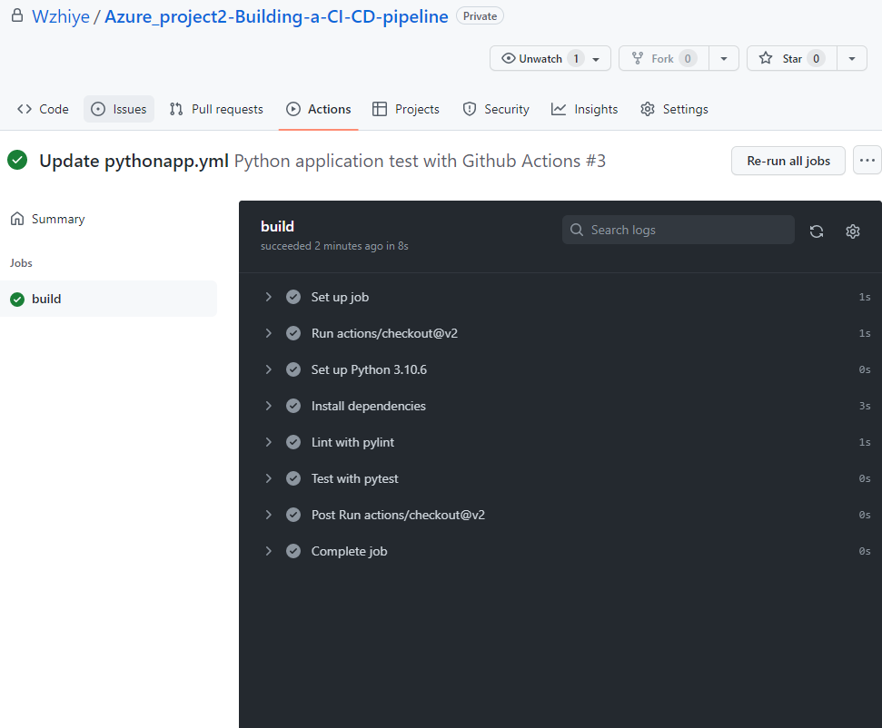
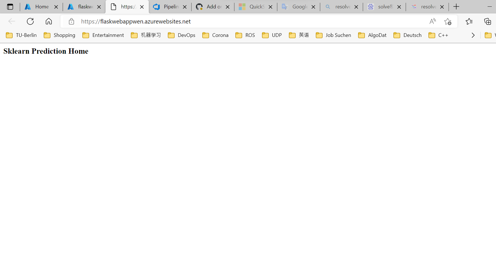
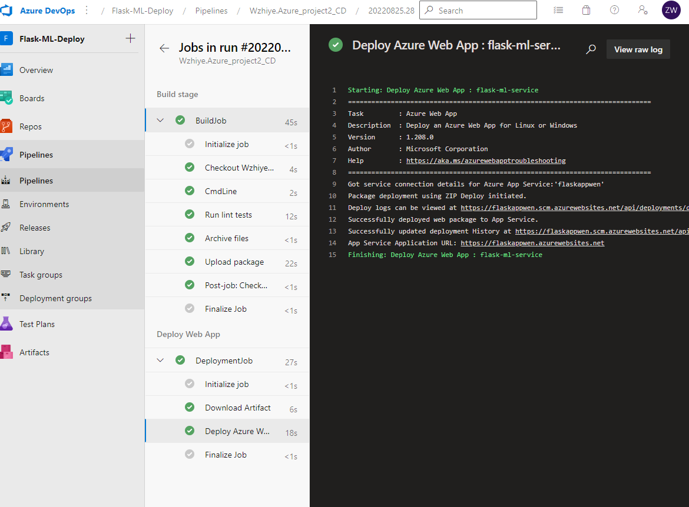
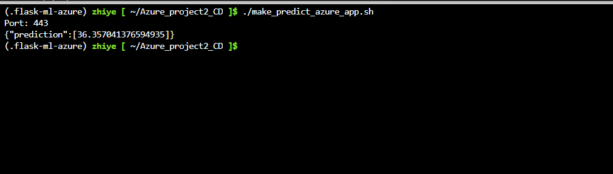
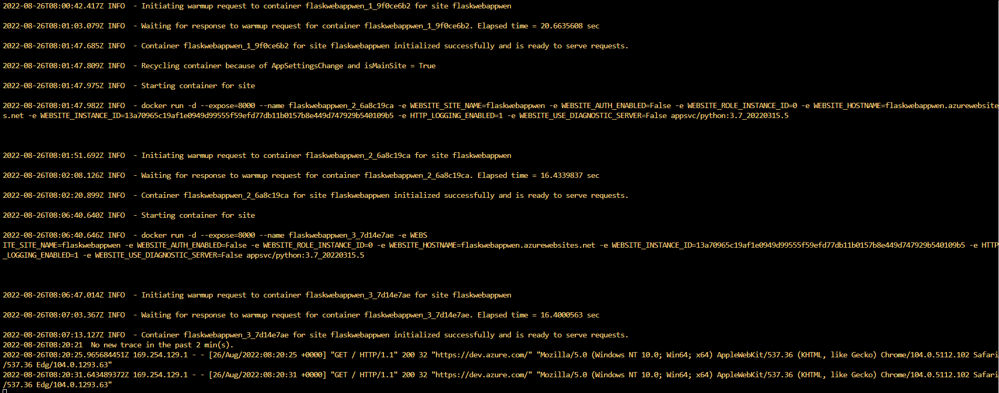

# Overview
[](https://github.com/Wzhiye/Azure_project2_CD/actions/workflows/pythonapp.yml)

In this Project, we built a Python web application and deploying it in a CI/CD pipeline using Azure App Services. The web application is a Python-based machine learning application using the Flask web framework. In this application, a pre-trained sklearn model is appiled to predict housing prices in Boston according to several features, such as average rooms in a home and data about highway access, teacher-to-pupil ratios, and so on. In order to create this CI/CD pipeline, the project Github repository is connected to Azure and Github action is used to perform an initial lint, test and install cycle. Then, Continuous Delivery for Azure App Service is implemented by Azure Pipelines.

## Project Plan

* A link to a Trello board for the project: [Trello](https://trello.com/invite/b/ckkOihBH/ceca85a6406f4bec51c3c5743e7c00f1/project2)

* A link to a spreadsheet that includes the original and final project plan: [Spreadsheet](https://docs.google.com/spreadsheets/d/15ubLyq8bP0X03wQ4vvEfCFMadQIrbONHOprxPECebUs/edit?usp=sharing)

## Architectural Diagram


## Instructions
* Project running on Azure App Service

### Set up Azure Cloud Shell

We can use Azure Cloud Shell with ssh-key to clone this project Repo in GitHub, the screenshot is as below:



### Run Makefile

We create a Makefile as below:
```bash
pip install --upgrade pip &&\
  	pip install -r requirements.txt
  
test:
  python -m pytest -vv test_hello.py

lint:
  	pylint --disable=R,C hello.py

all: install lint test
```
Run command `make all` to execute Makefile.

The output after execution of Makefile is:



### CI with GitHub Actions
We can use GitHub Actions to make Continuous Integration and test the change events in our project, the configuration in yml file can be as below:
```bash
name: Python application test with Github Actions

on: [push]

jobs:
  build:

    runs-on: ubuntu-latest

    steps:
    - uses: actions/checkout@v2
    - name: Set up Python 3.5
      uses: actions/setup-python@v1
      with:
        python-version: 3.5
    - name: Install dependencies
      run: |
        make install
    - name: Lint with pylint
      run: |
        make lint
    - name: Test with pytest
      run: |
        make test
```
After run the test in GitHub Actions, we can get a output as below:



### Create a web app


In this part, we need use Azure App Services to create a web app to apply Flask ML API and then deploy app in Azure Pipleine.

To create the web app, we can use azure command：
```bash
az webapp up --name flaskwebappwen --resource-group azuredevops --runtime "PYTHON:3.7"
```
If create successfully, we can open the URL of web app and see this website:


### CD: Deployment in Azure Pipelines.  
[The official documentation about CI/CD](https://docs.microsoft.com/en-us/azure/devops/pipelines/ecosystems/python-webapp?view=azure-devops).
In Azure DevOps Organizations, we can create a new project for CI/CD pipeline. We need first set up a new service connetction in organizations setting. Then, we need configure the pipline with our Github and the configuration is saved in `azure-pipelines.yml`.



We can test our deployed flask app in Azure Cloud Shell, run command:
`./make_predit_azure_app.sh`

The output is as below:



### Logs
We can inspect the logs from running application, run Azure command:
`az webapp log tail`



## Enhancements

* To improve the functions and UI on the web page, which can display forecast information and reference features, etc.
* To set the parameters as customizable variables that can be changed by the customer according to actual needs.


## Demo 

<TODO: Add link Screencast on YouTube>


